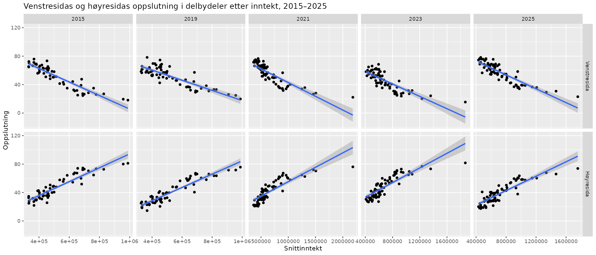

# Valganalyse Oslo

Prosjekt for å se på oppslutningen til de ulike partiene i valgkretser i Oslo koblet med levekårsdata (snittinntekt, innvandrerandel, utdanningsnivå) i delbydeler. Dekker kommune-/fylkestingsvalget 2015, 2019 og 2023, og stortingsvalget 2017, 2021 og 2025.

## Mappestruktur

- `skript.R` – hovedanalysen (beskrivende figurer), kjøres fra prosjektroten (åpne `valganalyse-oslo.Rproj` i RStudio)
- `analyse_partiutvikling.R` – statistisk analyse av hvordan sammenhengen mellom oppslutning og levekårsvariablene har utviklet seg over tid (se egen seksjon under)
- `data/` – valgresultater per stemmekrets, krets-til-delbydel-koblinger og levekårsdata
- `figurer/` – figurer generert av R-skriptene, og kartet som er brukt til å koble valgkretser til delbydeler
  - `figurer/opprinnelig-2019/` – ferdigstilte figurer fra det opprinnelige 2019-prosjektet (med korrelasjonstall og manuelle annoteringer som ikke lenger genereres av `skript.R`)

## Metodekommentarer:

### Kobling av valgkrets til delbydelsdata

Tallene for gjennomsnittsinntekt finnes i Oslo kommunes [statistikkbank](statistikkbanken.oslo.kommune.no). Her finnes tallene på delbydelsnivå, men det er ikke fullstendig overlapp mellom valgkrets og delbydel alle steder. Det er gjort skjønnsmessige vurderinger for samtlige valgkretser for hvilke delbydeler de korresponderer til ved hjelp av dette [kartet](figurer/Valgkretser.png), hvor delbydeler er lagt oppå valgkretser. Flere steder brukes inntektstatistikk fra én delbydel på to valglokaler, dersom de begge i stor grad ligger innenfor delbydelen. Der valgkretsene i stor grad er delt mellom flere delbydeler, er delbydeler slått sammen og det er regnet snitt av delbydelenes snittinntekt. Det er uansett gjennomgående slik at inntektene er relativt like mellom tilgrensende valgkretser, og i få tilfellene hvor det er store inntektsforskjeller mellom to tilgrensende delbydeler var det relativt enkelt å plassere valgkretsene korrekt. Fullstendig tabell som viser hvordan koblingene er gjort finnes [her](data/valgkrets_til_delbydel.xlsx)

To valgkretser er utelatt fordi det var overlapp av tre eller flere delbydeler hvor det ikke var noen selvsagt måte å tilegne dem inntektstatistikk. I tillegg er valgkretsen Oslo rådhus og delbydel sentrum (fra Nationalteateret til Oslo S) utelatt fordi snittinntekten i denne delbydelen også inneholder folk bosatt i marka eller de som ikke har en bostedsadresse i kommunens register.

### Nivåfeilslutning

Tallene i grafene er på bydelsnivå, og det er stor variasjon i levekår internt i bydelene. VI har derfor delt opp bydelene i mindre områder for nettopp å fange opp denne variasjonen. Selv om vi med dette fanger opp mer variasjon, er det fremdeles rom for det som kalles nivåfeilslutninger, siden det heller ikke er delbydeler, men velgere som stemte i kommunevalget. Vi påberoper oss derfor ikke å forklare stemmegivningen fult ut, men peker heller på geografiske forskjeller i hovedstaden sett i sammenheng med levekårsstatistikker i områdene.

### Forhåndsstemmer

Når vi ser på oppslutning i kommunevalget fordelt i valgkretsene, er ikke forhåndsstemmene tatt med siden de ikke fordeles geografisk, men samles opp sentralt. I Oslo utgjør det 152 587 stemmer (42 %) som ikke er tatt med i analysen. Derimot baserer analysen seg på 58 prosent av alle stemmene, og variasjonen mellom oppslutning blant forhåndsstemmene og stemmene avgitt på valgdagen er ikke så stor. Den største forskjellen i oppslutning blant forhåndsstemmene og på valgdagen finner vi hos MDG og Høyre. MDG har 3 prosentpoeng høyere oppslutning i forhåndsstemmene, og Høyre 2,5 prosentpoeng mindre oppslutning. Rødt har 1,5 prosentpoeng større oppslutning hos forhåndsstemmene og Venstre 2,4 prosent lavere oppslutning. For de andre partiene er det mindre enn ett prosentpoeng. Det ideelle hadde vært om forhåndsstemmene også hadde vært geografisk fordelt, likevel vil vi kommentere at å ha 58 prosent av samtlige stemmer er et godt datagrunnlag og gir et godt bilde på tendensene vi viser i analysen, særlig siden variasjonen mellom forhåndsstemmene og den endelige oppslutningen er såpass liten.

## Flerårig oppdatering (2021, 2023, 2025)

Prosjektet er utvidet med stortingsvalget 2021 og 2025, og kommunevalget 2023. Merk at 2015, 2019 og 2023 var kommune-/fylkestingsvalg, mens 2021 og 2025 er stortingsvalg – det er altså ikke nødvendigvis samme velgere eller samme parti-dynamikk som ligger bak tallene fra år til år, selv om valgkretsene stort sett er de samme geografiske områdene.

### Datakilder

- **Valgresultater** for 2021, 2023 og 2025 er hentet direkte fra det offentlige API-et til [valgresultat.no](https://valgresultat.no) (Valgdirektoratet), på stemmekretsnivå (`/api/{år}/{st|ko}/03/0301/...`). Forhåndsstemmelokaler (`forhaandsstemmelokale: true`) og ikke-geografiske samlekretser ("Uoppgitt krets" o.l.) er utelatt, på samme måte som forhåndsstemmer var utelatt fra den opprinnelige 2015/2019-analysen – tallene gjelder altså valgtingstemmer avgitt i den enkelte krets. Resultatene ligger i `data/valgkretser2021.csv`, `data/valgkretser2023.csv` og `data/valgkretser2025.csv`.
- **Demografi/levekår per delbydel** er hentet fra [Statistikkbanken til Oslo kommune](https://statistikkbanken.oslo.kommune.no) (samme system som SSBs PxWeb-API), for alle fem valgårene (`data/omradedata{år}.xlsx`):
  - *Snittinntekt*: gjennomsnittlig bruttoinntekt per delbydel, samme år som valget (tabell INN001). For 2025, hvor inntektstabellen ennå ikke har data, er 2024 brukt (siste tilgjengelige år).
  - *Innvandrerandel*: andel innvandrere og norskfødte med innvandrerforeldre, samme år som valget (tabell BEF024).
  - *AndelHoyereUtdanning*: andel av befolkningen 16+ år med universitets-/høgskoleutdanning, samme år som valget der tilgjengelig – for 2025 er 2023 brukt, siste tilgjengelige år (tabell UTD027).
  
  Innvandrerandel og utdanningsnivå for 2015 og 2019 er hentet fra samme kilde i ettertid og finnes nå også i `data/omradedata2015.xlsx`/`data/omradedata2019.xlsx`, men inntektstallene for disse to årene i de opprinnelige figurene (`oppslutning_etter_inntekt_2019.png` m.fl.) kommer fortsatt fra den opprinnelige `data/inntekt.xls`, ikke fra statistikkbanken, for å ikke endre tall som allerede er publisert. Der en valgkrets dekker flere delbydeler er komponentene slått sammen med samme logikk som i den opprinnelige analysen (snitt for inntekt; folketallsveid snitt for innvandrerandel og utdanningsnivå, siden vi her har folketall tilgjengelig).

### Kobling av valgkretser til delbydel per år

Antall stemmekretser i Oslo har variert litt (100 i 2019/2025, 103 i 2021, 101 i 2023) fordi stemmesteder jevnlig legges ned, flyttes eller slås sammen (nye skolebygg, endrede kretsgrenser mv.). Hvert år har derfor sin egen koblingsfil (`data/valgkrets_til_delbydel{år}.xlsx`), bygget trinnvis fra den opprinnelige 2019-koblingen:

- Rene stavemåte-/store forbokstav-endringer (f.eks. «Fyrstikkaléen» → «Fyrstikkalleen» → «Fyrstikkalléen») er rettet direkte.
- Nedlagte stemmesteder er koblet til delbydelen til stemmestedet som overtok området, funnet ved å sammenligne kretslisten per bydel før og etter hver endring, og verifisert mot adressen til det nye stemmestedet (f.eks. «Ellingsrudåsen skole» → «Bakås skole», begge i delbydel Ellingsrud). Flere av disse endringene (f.eks. Granstangen skole, Nordseter skole) viste seg å skje allerede fra 2021 til 2023, noe som bekrefter koblingen som ble gjort for 2025 uavhengig.
- Enkelte helt nye, perifere kretser i marka-områder (Maridalen skole, og Sørkedalen skole/kirkestue) mangler delbydelsdata i alle kildene, og faller derfor bort på samme måte som Oslo rådhus/Sentrum alltid har gjort.

Dette er, som i den opprinnelige koblingen, gjort etter skjønn og bør leses med samme forbehold som er beskrevet over.

### Forbedringsideer til videre arbeid

- **Prisjustere inntektstallene** når flere år sammenlignes direkte, siden nominell inntekt har steget mye 2015–2024.
- **Befolkningsvekte** analysene (antall stemmeberettigede/innbyggere per krets), siden kretsene varierer mye i størrelse og en enkel krets-for-krets-sammenligning gir hver krets lik vekt uavhengig av folketall.
- **Kartvisualisering**: koble valgkretsene til faktiske kretsgrenser (Kartverket/Geonorge har WFS/OGC API for stemmekretser) for kart i stedet for kun spredningsplott.
- **Flere levekårsvariabler** finnes i samme statistikkbank og kunne vært interessante å teste, f.eks. husholdningstype/andel aleneboende, botid, eller valgdeltakelse per krets (som faktisk ligger i samme API-respons som stemmetallene).

## Statistisk analyse av utvikling over tid (`analyse_partiutvikling.R`)

Dette skriptet ser på hvordan *sammenhengen* mellom hvert partis oppslutning og de tre levekårsvariablene har endret seg fra valg til valg. Avgrenset til lokalvalgene 2015, 2019 og 2023, samt stortingsvalget 2017 (hentet på samme måte som 2021/2025 – se over) – altså ikke 2021 eller 2025, som er stortingsvalg nærmere i tid og allerede dekket i figurene over. I motsetning til resten av prosjektet er **Sentrum ikke holdt utenfor** her; alle bydeler er med.

Metode:

1. For hvert parti, valgår og variabel: en enkel lineær regresjon `Oppslutning ~ variabel` på kretsnivå, som gir et stigningstall (hvor mye oppslutningen endrer seg per enhet av variabelen), standardfeil, p-verdi og forklart varians (R²). Fullt resultat i `data/regresjonsresultater_partiutvikling.csv`, figur i `figurer/utvikling_regresjonskoeffisienter.png`.
2. En formell test av om stigningstallet har endret seg signifikant over de fire valgene: `Oppslutning ~ variabel × valgår` med valgår som kontinuerlig variabel, per parti og variabel. Interaksjonsleddet forteller om sammenhengen har blitt sterkere/svakere/snudd. Resultat i `data/regresjonsresultater_interaksjon.csv`.

**Hovedfunn:** Arbeiderpartiets sammenheng med både innvandrerandel og utdanningsnivå er klart svekket gjennom perioden (interaksjonsledd med desidert lavest p-verdi av alle, p < 10⁻¹⁵), og trekker i retning null – dvs. at hvor stor andel innvandrere eller hvor høyt utdanningsnivå det er i en krets, forklarer mindre av Aps oppslutning i 2023 enn i 2015. Samtidig er sammenhengen med inntekt fortsatt sterk og statistisk signifikant for Ap i alle fire valg, om enn noe svakere over tid. Høyres sammenheng med inntekt er òg signifikant svekket, men fortsatt klart til stede. Rødt og SV har fått en *sterkere* positiv sammenheng med innvandrerandel over tid, mens Senterpartiets sammenheng med utdanning har blitt tydelig mer negativ. For de fleste andre partier (FRP, KrF, MDG, V) er endringene enten svakere eller ikke statistisk signifikante i dette datagrunnlaget.
