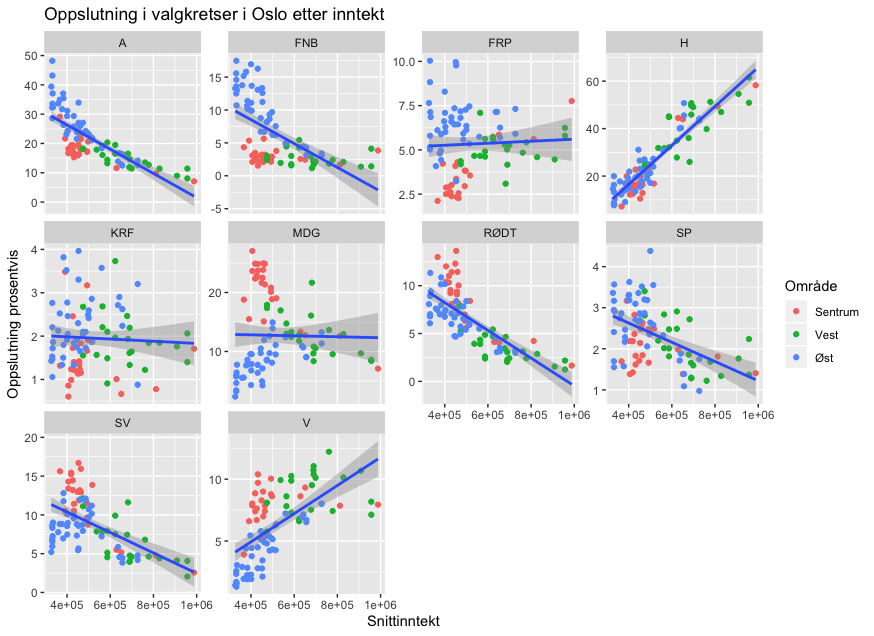

# Valganalyse Oslo

Prosjekt for å se på oppslutningen til de ulike partiene i valgkretser i Oslo koblet med levekårsdata (snittinntekt, innvandrerandel, utdanningsnivå) i delbydeler. Dekker kommune-/fylkestingsvalget 2015 og 2019, og stortingsvalget 2025.

## Mappestruktur

- `skript.R` – analysekoden, kjøres fra prosjektroten (åpne `valganalyse-oslo.Rproj` i RStudio)
- `data/` – valgresultater per stemmekrets, krets-til-delbydel-koblinger og levekårsdata
- `figurer/` – lagrede/eksporterte figurer og kartet som er brukt til å koble valgkretser til delbydeler

## Metodekommentarer:

### Kobling av valgkrets til delbydelsdata

Tallene for gjennomsnittsinntekt finnes i Oslo kommunes [statistikkbank](statistikkbanken.oslo.kommune.no). Her finnes tallene på delbydelsnivå, men det er ikke fullstendig overlapp mellom valgkrets og delbydel alle steder. Det er gjort skjønnsmessige vurderinger for samtlige valgkretser for hvilke delbydeler de korresponderer til ved hjelp av dette [kartet](figurer/Valgkretser.png), hvor delbydeler er lagt oppå valgkretser. Flere steder brukes inntektstatistikk fra én delbydel på to valglokaler, dersom de begge i stor grad ligger innenfor delbydelen. Der valgkretsene i stor grad er delt mellom flere delbydeler, er delbydeler slått sammen og det er regnet snitt av delbydelenes snittinntekt. Det er uansett gjennomgående slik at inntektene er relativt like mellom tilgrensende valgkretser, og i få tilfellene hvor det er store inntektsforskjeller mellom to tilgrensende delbydeler var det relativt enkelt å plassere valgkretsene korrekt. Fullstendig tabell som viser hvordan koblingene er gjort finnes [her](data/valgkrets_til_delbydel.xlsx)

To valgkretser er utelatt fordi det var overlapp av tre eller flere delbydeler hvor det ikke var noen selvsagt måte å tilegne dem inntektstatistikk. I tillegg er valgkretsen Oslo rådhus og delbydel sentrum (fra Nationalteateret til Oslo S) utelatt fordi snittinntekten i denne delbydelen også inneholder folk bosatt i marka eller de som ikke har en bostedsadresse i kommunens register.

### Nivåfeilslutning

Tallene i grafene er på bydelsnivå, og det er stor variasjon i levekår internt i bydelene. VI har derfor delt opp bydelene i mindre områder for nettopp å fange opp denne variasjonen. Selv om vi med dette fanger opp mer variasjon, er det fremdeles rom for det som kalles nivåfeilslutninger, siden det heller ikke er delbydeler, men velgere som stemte i kommunevalget. Vi påberoper oss derfor ikke å forklare stemmegivningen fult ut, men peker heller på geografiske forskjeller i hovedstaden sett i sammenheng med levekårsstatistikker i områdene.

### Forhåndsstemmer

Når vi ser på oppslutning i kommunevalget fordelt i valgkretsene, er ikke forhåndsstemmene tatt med siden de ikke fordeles geografisk, men samles opp sentralt. I Oslo utgjør det 152 587 stemmer (42 %) som ikke er tatt med i analysen. Derimot baserer analysen seg på 58 prosent av alle stemmene, og variasjonen mellom oppslutning blant forhåndsstemmene og stemmene avgitt på valgdagen er ikke så stor. Den største forskjellen i oppslutning blant forhåndsstemmene og på valgdagen finner vi hos MDG og Høyre. MDG har 3 prosentpoeng høyere oppslutning i forhåndsstemmene, og Høyre 2,5 prosentpoeng mindre oppslutning. Rødt har 1,5 prosentpoeng større oppslutning hos forhåndsstemmene og Venstre 2,4 prosent lavere oppslutning. For de andre partiene er det mindre enn ett prosentpoeng. Det ideelle hadde vært om forhåndsstemmene også hadde vært geografisk fordelt, likevel vil vi kommentere at å ha 58 prosent av samtlige stemmer er et godt datagrunnlag og gir et godt bilde på tendensene vi viser i analysen, særlig siden variasjonen mellom forhåndsstemmene og den endelige oppslutningen er såpass liten.

## 2025-oppdateringen

Prosjektet er utvidet med data fra stortingsvalget 2025. Merk at 2015 og 2019 var kommune-/fylkestingsvalg, mens 2025 er et stortingsvalg – det er altså ikke nødvendigvis samme velgere eller samme parti-dynamikk som ligger bak tallene, selv om valgkretsene stort sett er de samme geografiske områdene.

### Datakilder for 2025

- **Valgresultater** er hentet direkte fra det offentlige API-et til [valgresultat.no](https://valgresultat.no) (Valgdirektoratet), på stemmekretsnivå (`/api/2025/st/03/0301/...`). Forhåndsstemmelokaler (`forhaandsstemmelokale: true`) og ikke-geografiske samlekretser ("Uoppgitt krets" o.l.) er utelatt, på samme måte som forhåndsstemmer var utelatt fra 2015/2019-analysen – tallene gjelder altså valgtingstemmer avgitt i den enkelte krets. Resultatet ligger i [data/valgkretser2025.csv](data/valgkretser2025.csv).
- **Demografi/levekår per delbydel** er hentet fra [Statistikkbanken til Oslo kommune](https://statistikkbanken.oslo.kommune.no) (samme system som SSBs PxWeb-API), og samlet i [data/omradedata2025.xlsx](data/omradedata2025.xlsx):
  - *Snittinntekt*: gjennomsnittlig bruttoinntekt per delbydel, 2024 (tabell INN001).
  - *Innvandrerandel*: andel innvandrere og norskfødte med innvandrerforeldre, 2025 (tabell BEF024).
  - *AndelHoyereUtdanning*: andel av befolkningen 16+ år med universitets-/høgskoleutdanning, 2023, siste tilgjengelige år (tabell UTD027).
  
  De to sistnevnte er nye i denne oppdateringen og brukes kun for 2025, siden vi ikke har hentet tilsvarende historiske tall for 2015/2019. Der en valgkrets dekker flere delbydeler er komponentene slått sammen med samme logikk som i 2019-analysen (snitt for inntekt; folketallsveid snitt for innvandrerandel og utdanningsnivå, siden vi her har folketall tilgjengelig).

### Kobling av 2025-valgkretser til delbydel

Antall stemmekretser i Oslo er fortsatt 100, men rundt 15 stemmesteder er lagt ned, flyttet eller slått sammen siden 2019 (nye skolebygg, sammenslåtte kretser mv.). [data/valgkrets_til_delbydel2025.xlsx](data/valgkrets_til_delbydel2025.xlsx) er en oppdatert versjon av koblingsfilen som tar høyde for dette:

- Rene stavemåteendringer (f.eks. «Fyrstikkaléen» → «Fyrstikkalléen») er rettet direkte.
- Nedlagte stemmesteder er koblet til delbydelen til stemmestedet som overtok området, funnet ved å sammenligne kretslisten per bydel før og etter, og verifisert mot adressen til det nye stemmestedet (f.eks. «Ellingsrudåsen skole» → «Bakås skole», begge i delbydel Ellingsrud).
- To kretser (Maridalen skole, Sørkedalen kirkestue) er helt nye ytterkretser i marka-områder uten delbydelsdata i noen av kildene, og faller derfor bort på samme måte som Oslo rådhus/Sentrum alltid har gjort.

Dette er, som i den opprinnelige koblingen, gjort etter skjønn og bør leses med samme forbehold som er beskrevet over.

### Forbedringsideer til videre arbeid

- **Fylle inn 2021 og 2023**: stortingsvalget 2021 og kommunevalget 2023 kan hentes fra samme API og ville gi en sammenhengende tidsserie i stedet for tre enkeltpunkter.
- **Prisjustere inntektstallene** når flere år sammenlignes direkte, siden nominell inntekt har steget mye 2019–2024.
- **Befolkningsvekte** analysene (antall stemmeberettigede/innbyggere per krets), siden kretsene varierer mye i størrelse og en enkel krets-for-krets-sammenligning gir hver krets lik vekt uavhengig av folketall.
- **Kartvisualisering**: koble valgkretsene til faktiske kretsgrenser (Kartverket/Geonorge har WFS/OGC API for stemmekretser) for kart i stedet for kun spredningsplott.
- **Flere levekårsvariabler** finnes i samme statistikkbank og kunne vært interessante å teste, f.eks. husholdningstype/andel aleneboende, botid, eller valgdeltakelse per krets (som faktisk ligger i samme API-respons som stemmetallene).
